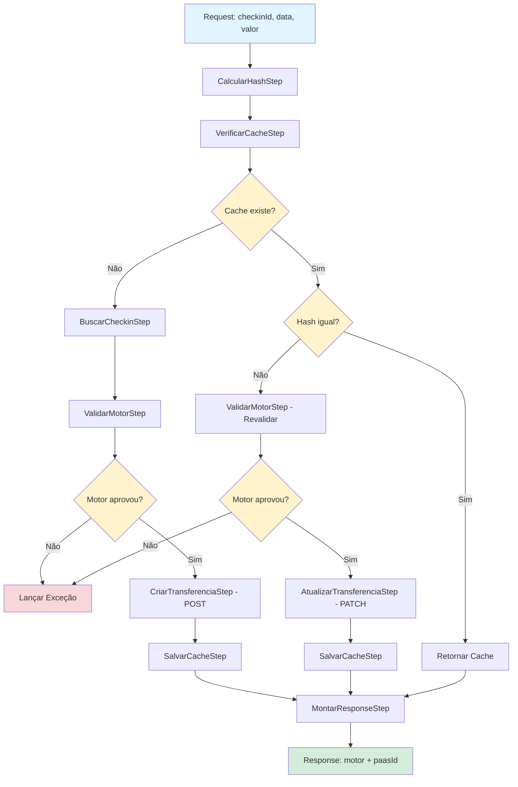
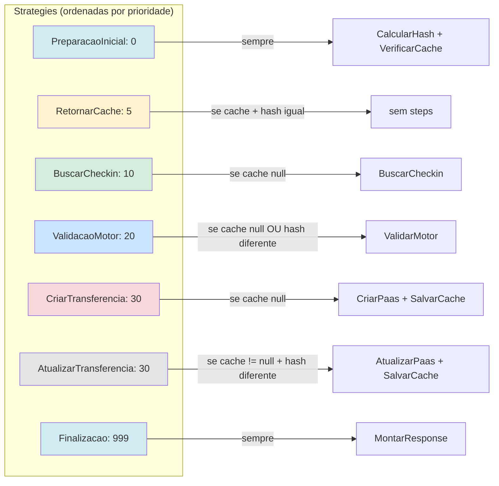
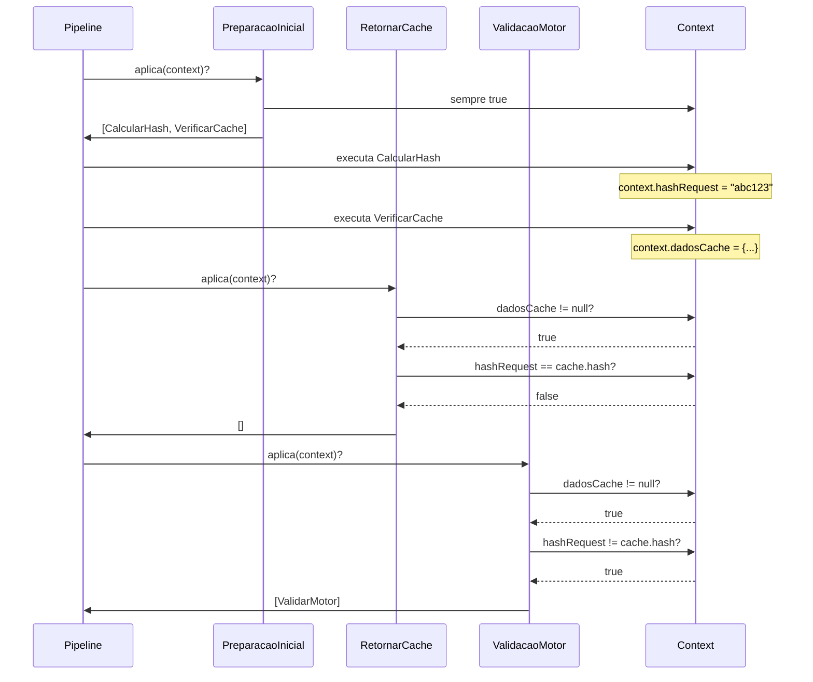

# Diagrama de Fluxo - Transferência

## Pipeline de Execução

```mermaid
graph TD
    Start[Request: checkinId, data, valor] --> CalcHash[CalcularHashStep]
    CalcHash --> VerifyCache[VerificarCacheStep]
    
    VerifyCache --> Decision{Cache existe?}
    
    Decision -->|Não| BuscarCheckin[BuscarCheckinStep]
    Decision -->|Sim| CompareHash{Hash igual?}
    
    CompareHash -->|Sim| ReturnCache[Retornar Cache]
    CompareHash -->|Não| RevalidateMotor[ValidarMotorStep - Revalidar]
    
    BuscarCheckin --> ValidateMotor[ValidarMotorStep]
    ValidateMotor --> MotorOk{Motor aprovou?}
    
    MotorOk -->|Não| Error[Lançar Exceção]
    MotorOk -->|Sim| CreatePaas[CriarTransferenciaStep - POST]
    
    RevalidateMotor --> RevalidateOk{Motor aprovou?}
    RevalidateOk -->|Não| Error
    RevalidateOk -->|Sim| UpdatePaas[AtualizarTransferenciaStep - PATCH]
    
    CreatePaas --> SaveCache1[SalvarCacheStep]
    UpdatePaas --> SaveCache2[SalvarCacheStep]
    
    SaveCache1 --> Mount[MontarResponseStep]
    SaveCache2 --> Mount
    ReturnCache --> Mount
    
    Mount --> Response[Response: motor + paasId]
    
    style Start fill:#e1f5ff
    style Response fill:#d4edda
    style Error fill:#f8d7da
    style Decision fill:#fff3cd
    style CompareHash fill:#fff3cd
    style MotorOk fill:#fff3cd
    style RevalidateOk fill:#fff3cd
```

## Estratégias de Decisão

```mermaid
graph LR
    subgraph "Strategies (ordenadas por prioridade)"
        S1[PreparacaoInicial: 0]
        S2[RetornarCache: 5]
        S3[BuscarCheckin: 10]
        S4[ValidacaoMotor: 20]
        S5[CriarTransferencia: 30]
        S6[AtualizarTransferencia: 30]
        S7[Finalizacao: 999]
    end
    
    S1 -->|sempre| Prep[CalcularHash + VerificarCache]
    S2 -->|se cache + hash igual| Nada[sem steps]
    S3 -->|se cache null| Buscar[BuscarCheckin]
    S4 -->|se cache null OU hash diferente| Motor[ValidarMotor]
    S5 -->|se cache null| Criar[CriarPaas + SalvarCache]
    S6 -->|se cache != null + hash diferente| Atualizar[AtualizarPaas + SalvarCache]
    S7 -->|sempre| Final[MontarResponse]
    
    style S1 fill:#d1ecf1
    style S2 fill:#fff3cd
    style S3 fill:#d4edda
    style S4 fill:#cce5ff
    style S5 fill:#f8d7da
    style S6 fill:#e2e3e5
    style S7 fill:#d1ecf1
```

## Decisões Baseadas em Contexto

```mermaid
sequenceDiagram
    participant Pipeline
    participant Strategy1 as PreparacaoInicial
    participant Strategy2 as RetornarCache
    participant Strategy3 as ValidacaoMotor
    participant Context
    
    Pipeline->>Strategy1: aplica(context)?
    Strategy1->>Context: sempre true
    Strategy1->>Pipeline: [CalcularHash, VerificarCache]
    
    Pipeline->>Context: executa CalcularHash
    Note over Context: context.hashRequest = "abc123"
    
    Pipeline->>Context: executa VerificarCache
    Note over Context: context.dadosCache = {...}
    
    Pipeline->>Strategy2: aplica(context)?
    Strategy2->>Context: dadosCache != null?
    Context-->>Strategy2: true
    Strategy2->>Context: hashRequest == cache.hash?
    Context-->>Strategy2: false
    Strategy2->>Pipeline: []
    
    Pipeline->>Strategy3: aplica(context)?
    Strategy3->>Context: dadosCache != null?
    Context-->>Strategy3: true
    Strategy3->>Context: hashRequest != cache.hash?
    Context-->>Strategy3: true
    Strategy3->>Pipeline: [ValidarMotor]
```
